# **Unique Beauty**

Unique Beauty Website is an imaginary website designed for selling cosmetics. I have worked on it as a student of [Code Institute](https://codeinstitute.net/) for my fifth portofolio project. This webpage is created using [Code Institute Full Template](https://github.com/Code-Institute-Org/ci-full-template).

[View the live project here!](https://unique-beauty-p5-092d291f63b2.herokuapp.com/)

[View the Github repository](https://github.com/Saleha-m14/Unique-Beauty/)

 **Table of Contents**
- [**Unique Beauty**](#unique-beauty)
  - [Project Goals](#project-goals)
  - [User Stories](#user-stories)
  - [Frameworks, Libraries \& Tools](#frameworks-libraries--tools)
  - [Testing](#testing)
  - [Deployment](#deployment)
    - [Github Repository](#github-repository)
    - [Deploying with heroku](#deploying-with-heroku)
  - [Languages](#languages)
  - [Code](#code)
  - [Text](#text)
  - [Media](#media)
  - [Acknowledgements](#acknowledgements)
## Project Goals

The main purpose is to create an eccommerce application for Unique Beauty to sell their products using it.
When the shopper opens this website can easily click on the SHOP NOW button to view the products or search for a spcific product that they are looking for. And the secure payment method for the user 
to purchase a product.

## User Stories

  - ### Administrator
    - As a website admin, I can log in to admin panel using the super user.
    - As a website admin, I can view the products and categories so that I can make changes to them.
    - As an Admin, I want each product to have the Shop Now and View buttons so that they can be added to the bag or the product detail is view.
    - As an admin, I want the user to have the ability to add reviews to a product so that I can read the user's reviews.
    - As an admin, I want the website to have a contact form that the user can fill in to contact with site admin.

  - ### First Time User
    - As a first time user, I want to view the website homepage and find information about Unique Beauty.
    - As a first time user, I want to see different categories of products to see what kind of products are available.
    - As a first time user, I want to see a search input field to find easily something that I am looking for.
    - As a first time user, I want to see a button that can be clicked to see all the products.
    - As a first time user, I want to see product name, image and price.
    - As a first time user, I want to be able to select the quantity of an item that I want to buy.
    - As a first time user, I want to see all the details and informations of a specific product by clicking on it.
    - As a first time user, I want the website to have a navbar with the links of different pages and categories so that I can navigate between the pages easily.
    - As a first time user, I want to the webpage to have the signup form so that I can register for an account.
    - As a site user, I want to receive a confirmation email after registering so that I can verify that my account registration was successful.
  
- ### Frequent User
  - As a returning user, I want to be able to login using my username and password to see my account information.
  - As a returning user, I want to have a personalized user profile so that I can view my personal order history and order confirmations, and save my payment information.
  - As a site user, I want to easily log in or log out so that I can easily access my personal account information..
  - As a shopper, I want to have a shopping bag to add the products to it so I can see all the products and the total price I want to buy.
  - As a shopper, when I view a product I want to see the add to bag button so that I can click on it and add the product to the bag.
  - As a site user, I want the user to have the ability to add reviews to a product so that the admin can read the user's reviews.
  - As a site user, I want the website to have a contact form that the user can fill in to contact with manager of the shop.
  - As a shopper, I want the site to havve the input field for the quantity of a product to specify how many of it I want to buy.
  - As a shopper, I want each product to have the Shop Now and View buttons so that they can be added to the bag or the product detail is viewed.
  - As a shopper, I want to select the quantity of the product when purchasing it to ensure that I do not select the wrong quantity of the product I want to buy.
  - As a shopper, I want to view the items that I have already added to my shopping bag so that I can identify all the items that I have added and the total cost of them.
  - As a shopper, I want to be able to update the quantity of an item in the bag so that I can have the ability to make changes to the product before checkout.
  - As a shopper, I want to have the ability to remove an item that is added to the shopping bag so that I can remove something that is unintentionally added to the bag before checkout.
  - As a shopper, I want to have the ability to easily enter my payment information so that I can check out the items that are in the shopping bag.
  - As a shopper, I want to feel safe when entering my personal and payment information so that I can provide the needed information to check out an item.

- ### Agile Methodology

The user stories are added to project as [issues in the Github](https://github.com/Saleha-m14/Unique-Beauty/issues) and are prioritzed using lables. The [Kanban Board](https://github.com/users/Saleha-m14/projects/5) is used to implement Agile in this project. This way I have devided all tasks and managed to complete the project.

- ### Features

  - #### Navbar

    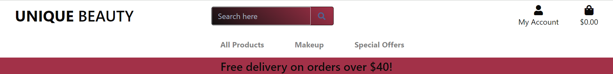
    The navbar is fixed on the top of the page. It contains several links. 
    -  It has a Unique Beauty logo. O the desktop view it is on the left side and is linked to the home page. 
    -  In the middle of the page the search input filed is added to search for products. 
    -  On the right side of the page the account dropdown exists and when it is clicked it opens dropdowns menu according to user authentication. If the user is authentiacated and superuser it opens the product management link, my profile, and logout. If the user is only authenticated and not a superuser the my profile and logout will open otherweise it will open link to register and login forms.
    -  On the right side of the page and next to the account the shopping bag is positioned. It is linked to the shopping_bag.html file that all the bag items are added to it. It also displays the total cost of all the bag items.

  - #### Home Page
  
    
    The homepage has a background image that is in the center of the page and on the page a short text(If you want to look unique use Unique Beauty products.) is written. On the bottom of the text the shop now button exists that is linked to the products page. Once it is clicked it will open the list of all available products.

  - #### Register Page 
  
    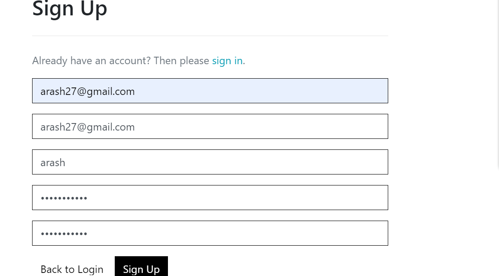
    - This page allows users to signup to create a profile where their data can be stored for future purchases.
    - This uses the allauth features for authorisation

  - #### login Page 
  
    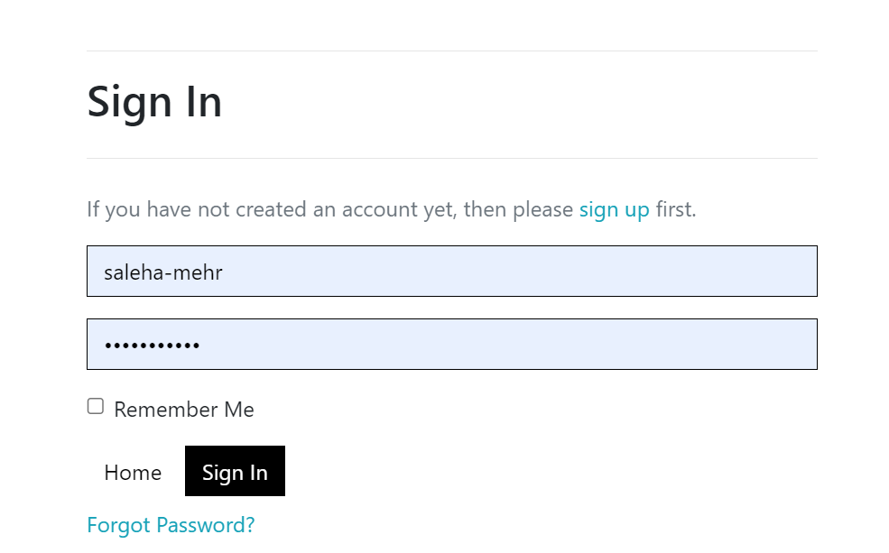
    This page will allow the user to login using username and password.
    
  - #### Contact Us 
  
    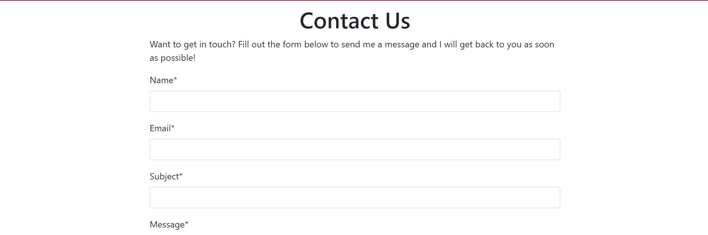
    Users are able to send messages to the company via the Contact Us Form.
    
  - #### Blog Posts 
  
    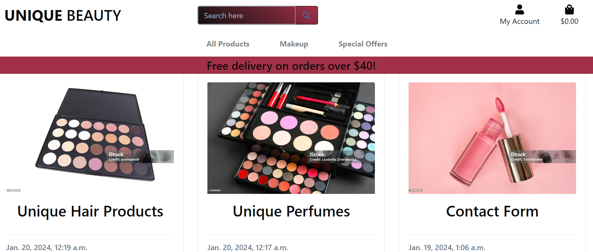
    Another feature of the website is the Blog section
    This contains blog posts uploaded by Admin about the beauty products.
    
  - #### Products

    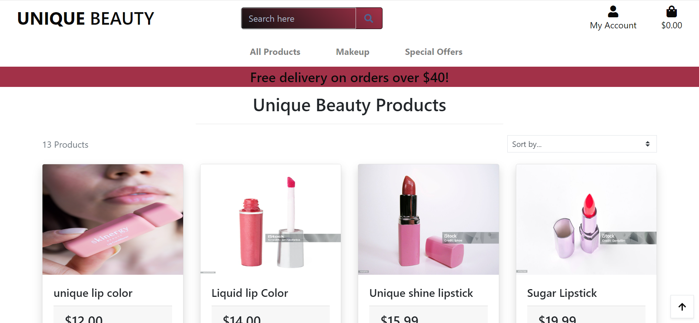
    When the shop now button is clicked it will open the list of all available products. 
    -  On the top of the products page the page header with the text of Unique Beauty Products is added.
    - In this page all the products are listed that each product is in a seperate card.
    - The product image is added on the top and the product name is written as the card title. The product rating, price and also the shop now and view buttons are in the card footer.
    - The quantity input is not displayed because it takes too much of the space.
    - If the shoper wants to buy a product can easily click on the shop now button. Since the quantity value is one as default so one item will be added to the bag.
    - If the shopper needs more details of the product can easily click on the view or the product image to open the product details page.

  - #### Product Details Page
  
    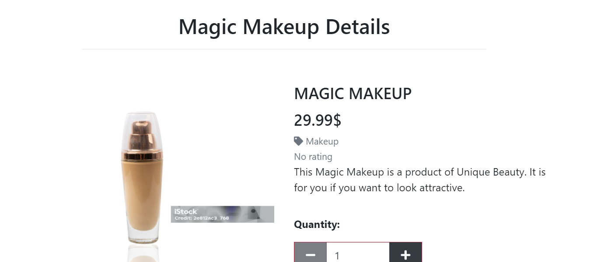
    - When the user clicks on a product image or view button the product details page will open.
    - The page title is on the top
    - The product details contains all the details of a such as product image, name, price, rating, description, quantity input, keep shopping and add to bug buttons.
    - The user can open the image on a new page by clicking on it.
    - The user can select the number of item to be purchased.
    - The keep shopping button will bring the shopper back to the all products page if the user wantedd to buy more products and the add to bag button will add the product with its quantity to the shopping back.
  
  - #### Shopping Bag
    
    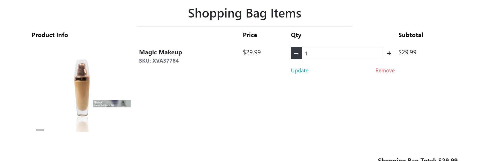
    - If any item doesn't exist in the shopping bag a text is inserted that tells you that there is not any product in the bag and a shop now button will be there to take you to the prodcuts page.
    - If item in the shopping bag exists it will display each item details in a single row.
    - Each row will have five columns. In the first column will be the product image and in the second on the product name and sku. In the third column will be product price, the product quantity input will be in the fourth column and in the last column will be the subtotal.
    - In the bottom of the page and on the desktop view on the right corner of the page the total cost of all products, delivery cost, grand total and keep shopping and checkout buttons are added.

  - #### Checkout 
  
    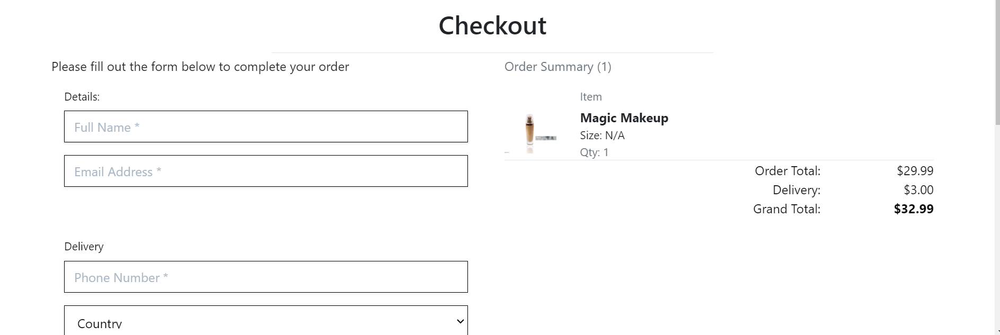
    - Once a user is happy to proceed to paying for the items, they are brough to the secure checkout page.
    - They are asked to enter details including name, email, address and billing information
    - Registered users have the option to save details for next purchase if they wish
  
  - #### Profile 
  
    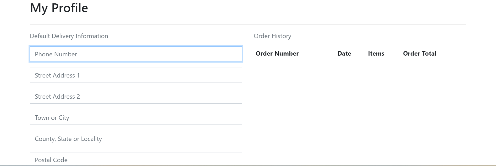
    - Registered users are given a profile page which displays their personal information and order history
  
  - #### Admin

    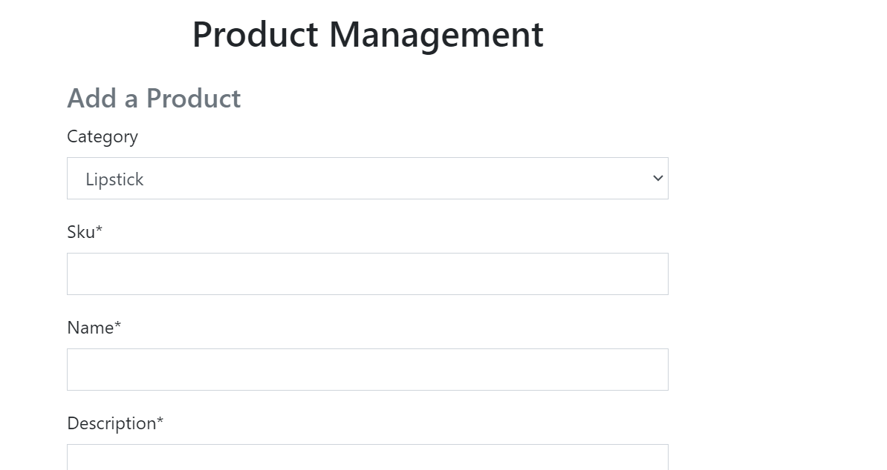
    - The Admin section provides access to superusers to modify many aspects of the website
    - They have access to the Product pages to add or edit products
    - New product categories can be added or modified
  

## Frameworks, Libraries & Tools

- [**Heroku**](https://dashboard.heroku.com/apps) is used for deploying this project
- [**Github**](https://github.com/) is used to store the project.
- [**Codeanywhere**](https://codeanywhere.com/) is used as a development environment.
- [**Django**](https://docs.djangoproject.com/) that is a python framework.
- [**Cloudinary**](https://cloudinary.com/)is used for media and static files.
- [**Database-URL**](https://pypi.org/project/dj-database-url/0.5.0/)is used to represent database settings
- [**Gunicorn**](https://pypi.org/project/gunicorn/20.1.0/) is used to run Django on heroku.
- [**XML-sitemap**](https://www.xml-sitemaps.com/) is used to create the sitemap.xml file
- [**Psycopg2**](https://pypi.org/project/psycopg2/2.9.3/) to connect Postgre SQL
- [**Bootstrap**](https://getbootstrap.com/) used for the frontend
- [**allauth**](https://docs.allauth.org/en/latest/release-notes/recent.html)
- [*Free Logo Maker Looka**](https://looka.com/editor/163700118) is used to create the Unique Beauty logo
- [**Am I responsive**](https://ui.dev/amiresponsive) is used to check if the website is responsive to different devices.
- [**Github issues & Kennan Board**](https://github.com/users/Saleha-m14/projects/3/views/1) is used to track the progress of the project.

## Testing

The website is tested on different browsers and devices for the responsiveness and accessability.

- ### Responsiveness Testing
  The website was tested for responsiveness using the Chrome and Firefox browsers and their associated Developer Tools. It was also tested on a real mobile phone to look for display problems on the smaller screen.
  
  - #### Bugs
    | Bug | Solution | Status |
    | ---| ---| ---|
    | Authentication Error at checkout stating that you did not provide an API key | Added the SECRET_KEY and the error is resolved | Fixed |
    | Csrf verification failded at accounts login page | Added the csrf_token | Fixed |
    | name context is not defined at order history | The context was not spelled correctly. | Fixed |
    | The website styling was not working properly on the deployed site | Set the DEBUG to False and redeployed | Fixed |
    | The payments was created on the stripe dashboard but there was not any payment succeeded | checked the files for any mistake and found the typing mistake on succeeded | Fixed |
    | TypeError at accounts signup that was SMTP.starttls()got an unexpected keyword argument 'keyfile' | The problem was with python version so I created a runtime.txt file and added python-3.9.18 | Fixed |
    | The create a bucket on the aws was not active | I descided to use cloudinary for hosting media files | Unfixed | 
    | I was getting an error on the shopping bag page when I try to open it. On the deployed site Server Error (500) exists and when I run it locally I saw the error TemplateDoesNotExist at /shopping_bag/
    shopping_bag/product.image.url | The typing mistake on the bag items for loop was fixed. | Fixed |
    | The products were added to the site but they were lost I mean when I was viewing the products page there was 0 Products | I switched from the local database to Elephant SQL and added the products again. | Fixed |
    

- #### Remaining Bugs

  There is not any known bugs in my project.

- ### Testing User Stories
    All the user stories are tested.
- ### Administration
    | Title | User Story Detail | Expected Result | Result |
    | ---| ---| ---| ---|
    | Manage store Products | As a site admin I can create, read, upadate and delete products on the site | Admin can add and update product | As expected |
    | Add Blog Posts | As a site admin I can create, read, upadate and delete posts on the site | Admin can add and update posts | As expected |
    | Product Management | When I login as an admin I want to see the product management when clicking on account so that I can add a product in the store. | The superuser can click on the product management link | As expected |
    | Edit and Delete links on each product for site admin | When I login as an admin I want to see the edit and delete link on each product in the product detail so that I can easily update or delete a product | The edit and delete buttons for superuser | As expected |
    | View reviews | As a site admin I want to view the reviews on a product so that I can read the comments | Admin can view the product review | As expected |
    | Approve reviews | As a site admin I want to approve the reviews on a product so that I can decide which reviews to dispaly on the site | Admin can approve the product review | Not as expected |
    
    
- ### Registration 
    | Title | User Story Detail | Expected Result | Result |
    | ---| ---| ---| ---|
    | Account Registration | As a site user I want to register for an account so that I can purchase products and save my information. | The site user can register for an account and save the info in the profile | As expected |
    | Login | As a site user I can login to my account using username and password so that I can access my orders and see the previous orders | Previous orders are displayed in the profile page | As expected | 
    | Logout | As a site user I can logout of my account so that I can keep my account save from other users | Users can logout and once logout of the account can not access the profile anymore | As expected |
    
- ### Frequent User
    | Title | User Story Detail | Expected Result | Result |
    | ---| ---| ---| ---|
    | Personalized Profile | As a site user I want to have a personalized user profile so that I can save my shopping details on it. | Users can save personal details on profile | As expected |
    | Add reviews | As a site user I want to be able to add reviews on the products so that I can engage with other usrs | Registered users can submit a review on a product |  As expected | 
    | Edit a review | As a site user I want to edit a review so that I can fix any typing mistakes | Users can edit the review | Not as expected |
    | View previous orders details | As a site user I want to have the ability to view my previous orders sot tha I can see the order details | The user can see his or her previous order details | As expected |
    | Checkout Bag Items | As a site user I want to have the ability to go to secure checkout so that I can complete my order | Users can checkout and purchase items | As expected |

## Deployment

I used the COdeanywhere to develop the website and the site is deployed using [Heroku.](https://heroku.com/)

### Github Repository 

  -  Login to your github account and navigate to your repositories and click on New.
  -  Select a template(the Code Institute full template is used for this project).[Code-Institute-Org/     python-essentials-template](https://github.com/Code-Institute-Org/ci-full-template)
  -  Write a name for your repository
  -  Select public
  -  Click on create to create your repository.
  -  Copy the link of your repository
  -  log in to codeanywhere using github
  -  click on crete new workspace and paste the github url.
  -  Run the commands first "git add .", then "git commit -m "commit message" and finally "git push" to push the files to github.

### Deploying with heroku

  This project is deployed using [Heroku](https://id.heroku.com/) and following the instruction of deployment video of Course Institue. These are the deployment steps:

  1. Open Heroku and click on "Create New App".
  2. Write your app name and select region. You should give your app a unique name.
  3. On the new page click on "settings" and select Config Var and add the below keys:
    -  key: PORT & value 8000
    -  Add key: DATABASE_URL, this should have been created automatically by Heroku.
    -  Add key: CLOUDINARY_URL and the value as your cloudinary API Environment variable e.g.
    -  Add key: SECRET_KEY and the value as a complex string which will be used to provide    cryptographic signing.
  4. Click on "Deploy" tab.
  5. Select "Github" as deployment method.
  6. Search for your repository name and click connect.
  7. Make sure that "main" branch is selected and click on "Enable Automatic Deploys" then, click on "Deploy Branch".
  8.  Ensure DEBUG = False when making the final deployment
  9.  When your project is deployed you can open it simply by clicking "View".

## Languages

  -  Python
  -  JavaScript
  -  HTML5
  -  CSS3

## Code

  - [Django Documenation](https://docs.djangoproject.com/en/4.2/) was used to provide examples of code solutions and Django functionality.
  - [Bootstrap Documenation](https://getbootstrap.com/docs/4.1/getting-started/introduction/) was used to provide examples of Bootstrap functionality and building blocks.
- The code comprises of code based on Code Institute walkthroughs "Boutique Ado" and "I think therefore I blog" that have been customised to meet the specific requiremnets of the project, alonside custom code and models written by me.

## Text

   The texts are written by author.

## Media

    The images comes from [Pixels](https://www.pexels.com/)

## Acknowledgements

    I am thankful of tutor support team at Code Institute for their help and guidance with issues that I faced during working on this project.
    My Code Institute Mentor for feedback and suggestions.
